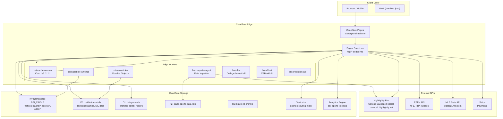
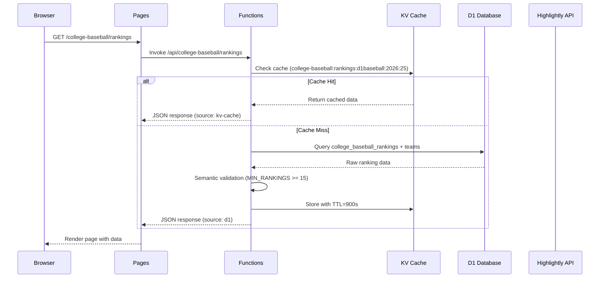
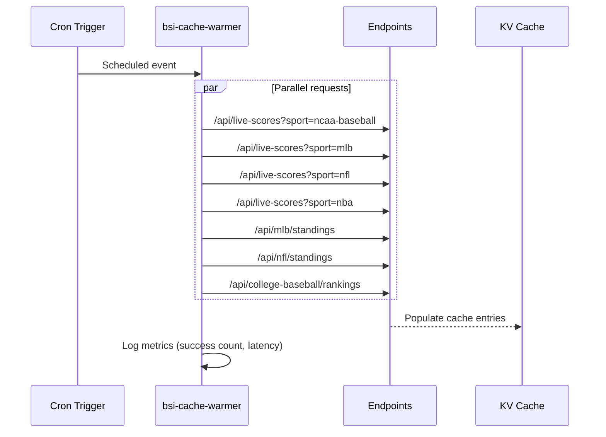
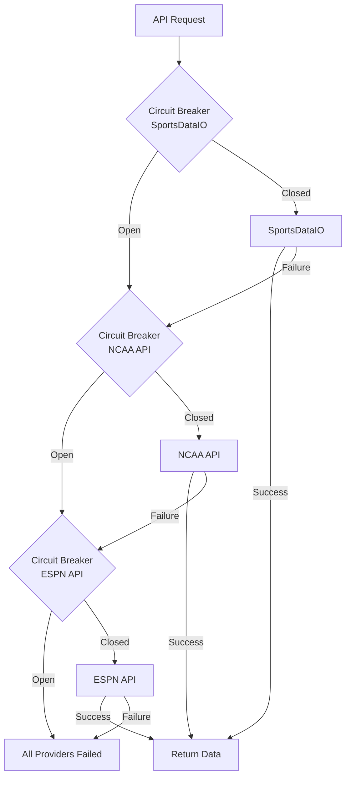
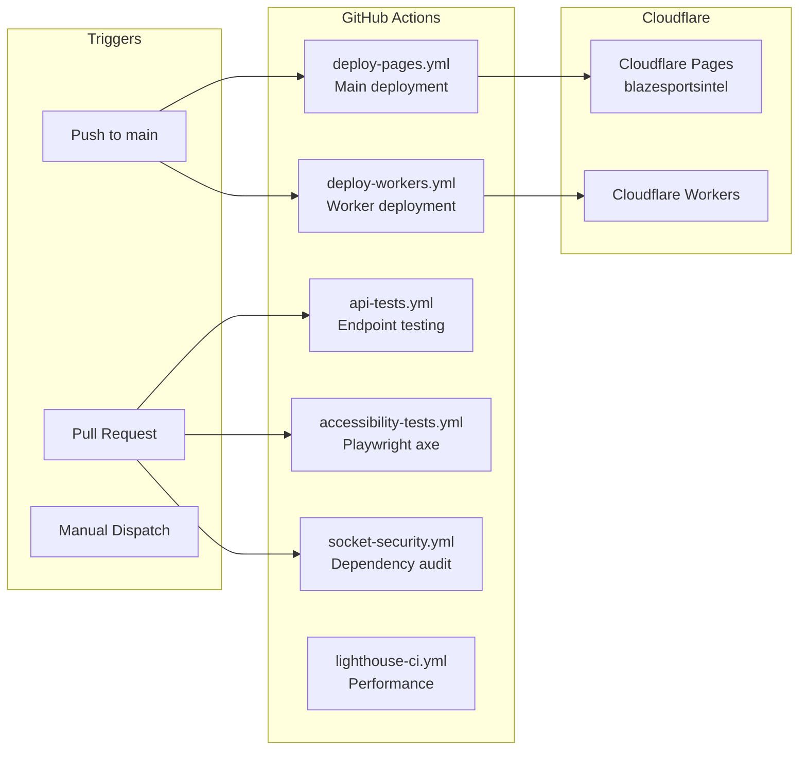

# BSI Architecture

**Domain:** blazesportsintel.com
**Platform:** Cloudflare (Pages + Workers + D1 + KV + R2)
**Frontend:** Next.js 16 / React 19 / TypeScript
**Last Updated:** 2026-01-16

---

## High-Level Architecture



---

## Request/Data Flow

### 1. User Request Flow (e.g., `/college-baseball/rankings`)



### 2. Cache Warming Flow (Cron: every 5 minutes)



### 3. Provider Failover Pattern



---

## Core Modules

| Module | Location | Responsibility | Key Dependencies |
|--------|----------|----------------|------------------|
| **Next.js App** | `app/` | SSG pages, routing, React components | React 19, Tailwind, Framer Motion |
| **Pages Functions** | `functions/api/` | API endpoints, edge compute | Cloudflare bindings (KV, D1, R2) |
| **Data Adapters** | `lib/adapters/` | Normalize external API responses | Highlightly, ESPN, MLB APIs |
| **Provider Manager** | `lib/adapters/provider-manager.ts` | Failover orchestration, circuit breaker | All adapters |
| **Workers** | `workers/` | Cron jobs, Durable Objects, specialized compute | Individual wrangler.toml configs |
| **UI Components** | `components/` | Reusable React components | lucide-react, recharts, Three.js |

---

## Data Adapters

| Adapter | Source | Sports | Priority |
|---------|--------|--------|----------|
| `highlightly-adapter.ts` | Highlightly Pro | College Baseball, College Football | Primary |
| `espn-unified-adapter.ts` | ESPN | NFL, NBA, CFB (fallback) | Secondary |
| `mlb-adapter.ts` | MLB Stats API | MLB | Primary |
| `nba-production-adapter.ts` | ESPN | NBA | Primary |
| `nfl-production-adapter.ts` | ESPN | NFL | Primary |
| `ncaa-baseball-adapter.ts` | NCAA | College Baseball (fallback) | Tertiary |

---

## Cloudflare Bindings (wrangler.toml)

### KV Namespaces
- `KV` (id: a53c3726fc3044be82e79d2d1e371d26) - Unified cache
- `NIL_CACHE` - Same ID, aliased for NIL-specific caching

**Key Prefixes:**
- `cache:*` - General API response caching
- `cache:nil:*` - NIL valuations
- `scores:*` - Live scores (60s TTL)
- `odds:*` - Betting odds (5min TTL)
- `session:*` - User sessions
- `rate_limit:*` - Rate limiting counters

### D1 Databases
- `DB` / `NIL_DB`: `bsi-historical-db` (9cecff0f-a3ab-433f-bf10-d2664d9542b0)
- `GAME_DB`: `bsi-game-db` (88eb676f-af0f-470c-a46a-b9429f5b51f3)

### R2 Buckets
- `SPORTS_DATA`: blaze-sports-data-lake
- `NIL_ARCHIVE`: blaze-nil-archive

### AI/ML
- `AI`: Workers AI binding
- `VECTORIZE`: sports-scouting-index
- `ANALYTICS`: bsi_sports_metrics dataset

---

## CI/CD Pipeline



**Deploy Process:**
1. `pnpm install`
2. `pnpm build` (Next.js static export)
3. Copy `functions/` and `lib/` to `out/`
4. `wrangler pages deploy out --project-name=blazesportsintel`
5. Post-deploy health check on `/api/health`

---

## API Response Contract

All API endpoints follow this standard format:

```typescript
interface APIResponse<T> {
  data: T | null;
  status: 'ok' | 'invalid' | 'unavailable';
  source: 'd1' | 'kv-cache' | 'highlightly' | 'espn';
  lastUpdated: string; // ISO 8601, America/Chicago
  reason: string; // Empty on success, error message on failure
  meta: {
    cache: { hit: boolean; ttlSeconds: number };
    planTier: 'highlightly_pro';
    quota: { remaining: number; resetAt: string };
  };
}
```

**HTTP Headers:**
- `X-BSI-Status`: ok | invalid | unavailable
- `X-BSI-Source`: Data source identifier
- `Cache-Control`: Varies by endpoint (60s for scores, 900s for rankings)

---

## Directory Structure

```
BSI/
├── app/                    # Next.js App Router (70+ routes)
│   ├── college-baseball/   # 18 routes: teams, rankings, scores, etc.
│   ├── mlb/                # 13 routes: games, standings, players
│   ├── nfl/                # 8 routes: games, standings, news
│   ├── nba/                # 2 routes (minimal coverage)
│   ├── cfb/                # 3 routes: hub, transfer portal, articles
│   └── dashboard/          # Analytics command center
├── components/             # React components
│   ├── ui/                 # Base components (Button, Card, etc.)
│   ├── dashboard/          # Dashboard-specific
│   ├── sports/             # Sport cards, BottomNav
│   └── three/              # Three.js hero effects
├── functions/              # Cloudflare Pages Functions
│   ├── api/                # 100+ API endpoints
│   │   ├── college-baseball/
│   │   ├── mlb/
│   │   ├── nfl/
│   │   ├── stripe/         # Payment integration
│   │   └── auth/           # Authentication
│   └── scheduled/          # Cron-triggered jobs
├── lib/                    # Shared utilities
│   ├── adapters/           # External API adapters
│   ├── cache/              # Caching utilities
│   ├── validation/         # Semantic validation
│   └── types/              # TypeScript definitions
├── workers/                # Standalone Cloudflare Workers
│   ├── bsi-cache-warmer/   # Cache warming cron
│   ├── bsi-news-ticker/    # Durable Objects ticker
│   ├── baseball-rankings/  # Rankings worker
│   └── ingest/             # Data ingestion
├── public/                 # Static assets (images, JS, CSS)
├── bsi-production/         # Legacy static HTML site
└── scripts/                # Build and automation scripts
```

---

## Key File References

| File | Line | Purpose |
|------|------|---------|
| `wrangler.toml` | 1-126 | All Cloudflare bindings and configuration |
| `lib/adapters/highlightly-adapter.ts` | 188-265 | Primary data fetching with retry logic |
| `lib/adapters/provider-manager.ts` | 29-141 | Circuit breaker failover pattern |
| `functions/api/college-baseball/rankings.js` | 21-240 | Example API endpoint with caching + validation |
| `workers/bsi-cache-warmer/index.ts` | 63-86 | Cache warming implementation |
| `.github/workflows/deploy-pages.yml` | 1-73 | Main CI/CD pipeline |
| `app/layout.tsx` | 102-126 | Root layout with providers |

---

*Generated: 2026-01-16 | See RISKS.md for identified risks*
