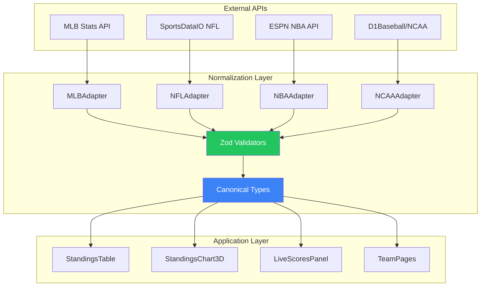
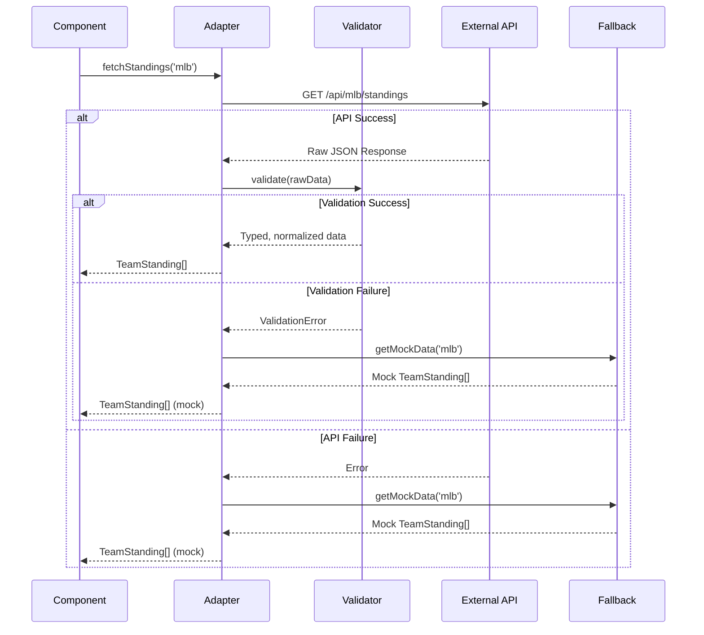

# API Response Normalization Layer Proposal

**Date:** 2025-12-25
**Status:** Proposed
**Author:** Staff Engineer Review

---

## Problem Statement

The BSI codebase currently handles API responses inconsistently across 53+ files. Each component implements its own parsing logic, leading to:

1. Type coercion bugs (see incident 2025-12-25)
2. Duplicated code across components
3. Inconsistent error handling
4. Multiple interface definitions for the same entities

---

## Proposed Architecture



---

## Data Flow Sequence



---

## Canonical Type Definitions

```typescript
// lib/types/sports.ts

/**
 * Canonical TeamStanding interface used across all components.
 * All API adapters must normalize to this shape.
 */
export interface TeamStanding {
  // Identity
  teamId: string;
  teamName: string;
  abbreviation: string;

  // Record
  wins: number;
  losses: number;
  winPct: number;

  // Standings context
  rank: number;
  gamesBack: number | null;
  divisionRank?: number;
  conferenceRank?: number;

  // Recent performance
  streak: string;        // Always normalized to "W3", "L2", "-"
  last10?: string;       // "7-3" format

  // Optional detailed stats
  runDiff?: number;      // MLB: runs scored - runs allowed
  pointDiff?: number;    // NFL/NBA: points scored - points allowed

  // Metadata
  division?: string;
  conference?: string;
  league?: string;

  // Display
  primaryColor?: string;
  secondaryColor?: string;
  logoUrl?: string;
}

/**
 * Canonical Game interface for scores
 */
export interface Game {
  id: string;

  homeTeam: TeamInfo;
  awayTeam: TeamInfo;

  status: GameStatus;

  // Period info (sport-specific but normalized)
  period?: string;       // "Top 7th", "Q3", "2nd Half"
  clock?: string;        // "3:45", "Final"

  // Venue
  venue?: string;

  // Timing
  startTime?: string;    // ISO 8601

  // Sport
  sport: 'mlb' | 'nfl' | 'nba' | 'cbb' | 'cfb';
}

export interface TeamInfo {
  id: string;
  name: string;
  abbreviation: string;
  score: number;
  record?: string;       // "10-5"
  seed?: number;         // Playoff seed
  logoUrl?: string;
}

export type GameStatus =
  | 'scheduled'
  | 'pregame'
  | 'live'
  | 'halftime'
  | 'final'
  | 'delayed'
  | 'postponed'
  | 'cancelled';
```

---

## Adapter Implementation Example

```typescript
// lib/adapters/mlb-adapter.ts

import { z } from 'zod';
import type { TeamStanding } from '../types/sports';

// Raw API response schema
const MLBStandingRawSchema = z.object({
  teamName: z.string(),
  wins: z.number(),
  losses: z.number(),
  winPercentage: z.number(),
  gamesBack: z.number().nullable(),
  division: z.string().optional(),
  league: z.string().optional(),
  runsScored: z.number().optional(),
  runsAllowed: z.number().optional(),
  streakCode: z.union([z.string(), z.number()]).optional(),
});

const MLBStandingsResponseSchema = z.object({
  standings: z.array(MLBStandingRawSchema),
  league: z.string().optional(),
  season: z.string().optional(),
});

type MLBStandingRaw = z.infer<typeof MLBStandingRawSchema>;

// Abbreviation lookup
const MLB_ABBREVIATIONS: Record<string, string> = {
  'Cardinals': 'STL',
  'Cubs': 'CHC',
  'Dodgers': 'LAD',
  // ... complete list
};

/**
 * Normalize streak to canonical "W3" / "L2" / "-" format
 */
function normalizeStreak(streak: string | number | undefined): string {
  if (streak === undefined || streak === null) return '-';

  if (typeof streak === 'string') {
    // Already formatted (e.g., "W3", "L2")
    if (/^[WL]\d+$/.test(streak)) return streak;
    // Code format (e.g., "W")
    return streak || '-';
  }

  if (typeof streak === 'number') {
    if (streak === 0) return '-';
    return streak > 0 ? `W${streak}` : `L${Math.abs(streak)}`;
  }

  return '-';
}

/**
 * Transform raw MLB API response to canonical TeamStanding
 */
function normalizeMLBStanding(raw: MLBStandingRaw, index: number): TeamStanding {
  const runDiff = (raw.runsScored ?? 0) - (raw.runsAllowed ?? 0);

  return {
    teamId: raw.teamName.toLowerCase().replace(/\s+/g, '-'),
    teamName: raw.teamName,
    abbreviation: MLB_ABBREVIATIONS[raw.teamName] ?? raw.teamName.substring(0, 3).toUpperCase(),
    wins: raw.wins,
    losses: raw.losses,
    winPct: raw.winPercentage,
    rank: index + 1,
    gamesBack: raw.gamesBack,
    streak: normalizeStreak(raw.streakCode),
    runDiff,
    division: raw.division,
    league: raw.league,
  };
}

/**
 * Fetch and normalize MLB standings
 */
export async function fetchMLBStandings(): Promise<TeamStanding[]> {
  const API_BASE = 'https://blazesportsintel.com/api';

  try {
    const response = await fetch(`${API_BASE}/mlb/standings`);

    if (!response.ok) {
      console.warn(`MLB API returned ${response.status}`);
      return getMLBFallbackData();
    }

    const rawData = await response.json();

    // Validate response shape
    const parseResult = MLBStandingsResponseSchema.safeParse(rawData);

    if (!parseResult.success) {
      console.error('MLB API validation failed:', parseResult.error.format());
      return getMLBFallbackData();
    }

    // Normalize to canonical shape
    return parseResult.data.standings.map(normalizeMLBStanding);

  } catch (error) {
    console.error('MLB API fetch failed:', error);
    return getMLBFallbackData();
  }
}

function getMLBFallbackData(): TeamStanding[] {
  return [
    {
      teamId: 'cardinals',
      teamName: 'Cardinals',
      abbreviation: 'STL',
      wins: 0,
      losses: 0,
      winPct: 0,
      rank: 1,
      gamesBack: null,
      streak: '-',
      division: 'NL Central',
      league: 'NL',
    },
    // ... more fallback data
  ];
}
```

---

## Migration Strategy

### Phase 1: Create Foundation (Week 1)
1. Add `zod` dependency
2. Create `lib/types/sports.ts` with canonical interfaces
3. Create `lib/adapters/` directory structure
4. Implement MLB adapter as proof of concept

### Phase 2: Migrate Standings (Week 2)
1. Update `StandingsTable.tsx` to use adapter
2. Update `StandingsChart3D.tsx` to use adapter
3. Update `app/mlb/standings/page.tsx`
4. Remove inline parsing logic

### Phase 3: Extend to Other Sports (Weeks 3-4)
1. Implement NFL adapter
2. Implement NBA adapter
3. Implement NCAA/College adapter
4. Update all consuming components

### Phase 4: Cleanup (Week 5)
1. Remove deprecated inline interfaces
2. Enable `strictNullChecks` in tsconfig
3. Add unit tests for adapters
4. Document API contracts

---

## File Structure

```
BSI/
├── lib/
│   ├── types/
│   │   ├── sports.ts           # Canonical interfaces
│   │   ├── api-responses.ts    # Raw API response types
│   │   └── index.ts
│   ├── adapters/
│   │   ├── mlb-adapter.ts
│   │   ├── nfl-adapter.ts
│   │   ├── nba-adapter.ts
│   │   ├── ncaa-adapter.ts
│   │   ├── utils/
│   │   │   ├── normalize-streak.ts
│   │   │   ├── safe-string.ts
│   │   │   └── fallback-data.ts
│   │   └── index.ts
│   └── validators/
│       ├── mlb-schemas.ts
│       ├── nfl-schemas.ts
│       ├── nba-schemas.ts
│       └── index.ts
```

---

## Success Criteria

1. **Zero type coercion runtime errors** in production
2. **Single source of truth** for TeamStanding interface
3. **100% Zod validation coverage** for all API responses
4. **TypeScript strictNullChecks enabled** with zero suppressions
5. **Adapter unit test coverage > 80%**

---

## Estimated Impact

| Metric | Current | After Implementation |
|--------|---------|---------------------|
| Type coercion bugs/month | ~2 | ~0 |
| Lines of parsing code | ~1500 (duplicated) | ~500 (centralized) |
| Interface definitions | 5+ duplicates | 1 canonical |
| API change adaptation time | Hours per component | Minutes (one file) |

---

## Dependencies

```json
{
  "dependencies": {
    "zod": "^3.23.0"
  }
}
```

---

## Risks

| Risk | Likelihood | Impact | Mitigation |
|------|------------|--------|------------|
| Breaking existing components | Medium | High | Gradual migration, feature flags |
| Performance overhead from validation | Low | Low | Validate only at boundary |
| Zod bundle size increase | Low | Medium | Tree-shake unused schemas |
| Team learning curve | Medium | Low | Documentation, pair programming |

---

*Proposal created: 2025-12-25*
*Confidence Level: 90%*
